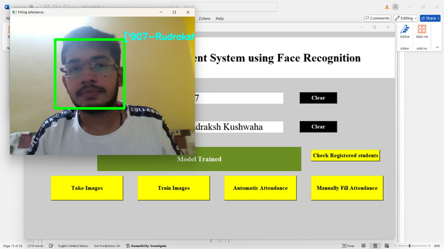

# Attendance Management System using Face Recognition

## Overview
The **Attendance Management System** is a Python-based application that leverages face recognition technology to automate the process of tracking student attendance. This project uses OpenCV for face detection and recognition, along with a user-friendly graphical interface built with Tkinter. It includes features for capturing images for training, real-time face recognition, and managing attendance records efficiently.

---
## Snapshots

Application asks for the Enrollment Number and the name and then we can take images or can save the face data in real time. After the capturing of Image has been done, a acknowledgement is provided that Image is saved for Enrollment: number Name: nameEntered


After the Image or face data has been saved, preprocessing is done internally and then we can train the model with the captured Image or face. Upon successful training we will see acknowledgement that the Model is trained.


Now it’s time for automatic attendance , we need to enter the subject name then a pop up camera window will appear and will automatically identifies you and will save your attendance in csv file.


Here is what the saved attendance will look like.


## Features
- **Face Recognition**: Automatically recognize students' faces and mark their attendance.
- **Image Capture**: Capture and save images for training the recognition model.
- **Manual Attendance**: Option to manually fill attendance records.
- **CSV Export**: Generate attendance reports in CSV format.
- **Database Integration**: Store attendance records in a MySQL database.

---

## Technologies Used
- **Python**
- **OpenCV**
- **Tkinter**
- **NumPy**
- **Pandas**
- **MySQL**
- **Pillow**

---

## Installation

### 1. Clone the Repository
```bash
git clone https://github.com/rudrakushwaha/faceRecognition.git
cd faceRecognition
```

### 2. Install Required Packages
Ensure Python is installed on your system, then install the necessary dependencies:
```bash
pip install -r requirements.txt
```

### 3. Run The App
python main.py

